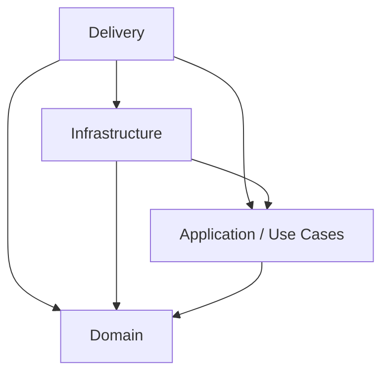

## Episode 3: Structuring Your Code to Reflect a Layered Architecture

## Objective

This episode is about layers. Your mission is to refactor the code into folders that represent a layered architecture and to enforce the Dependency Rule.

First task: read Robert C. Martin's blog article on Clean Architecture:
https://blog.cleancoder.com/uncle-bob/2012/08/13/the-clean-architecture.html

### The Dependency Rule

The overriding rule that makes this architecture work is the Dependency Rule. This rule says that source code dependencies can only point inwards. Nothing in an inner circle can know anything at all about something in an outer circle. In particular, the name of something declared in an outer circle must not be mentioned by the code in an inner circle. That includes functions, classes, variables, or any other named software entity.

---

## Requirements

### 1. Refactor Into Layers (Folders)

Right now the code is all in the main folder. Move it into a folder for each layer. A folder represents a layer. Depending on the complexity of projects there could be more or less layers, but for this episode we will use the four layers below. 

Your layers will be:

Delivery layer  
This layer is where the outside world gets access to the application. In a sense, the layer is where the application is delivered to the outside world and also from where calls from the outside world get delivered to application layer of the application. Create a folder called `delivery` which will represent the delivery layer.

Application layer  
This layer is where our use cases and DTO definitions live. At this point we are not going to change the code much, just move it into this folder which represents the layer. We also need to maintain the Dependency Rule, which means that our application layer should not know about any names (classes, frameworks, functions, etc.) that live in the delivery layer. Create a folder called `application` which will represent the application layer. Inside the application layer folder create folders for `usecases` and `dtos`.

Domain layer  
The domain is the deepest layer in our code and should be kept as simple as possible but not any simpler. The domain layer is where the domain classes and their invariants live. For this episode just move your domain code into a folder called `domain`. In the episode focused on the domain layer we will refactor this further.

Infrastructure layer  
This layer is where any interaction with infrastructure will happen. Create a folder called `infrastructure` which will represent the infrastructure layer and inside this folder create a folder called `repo` for repository code and place the repository code in that. Ensure tht the application layer does not depend on the infrastructure layer - this will be challenging.

### 2. Enforce the Dependency Rule

### 2. Enforce the Dependency Rule

For this episode, your task is to move the code into the appropriate folders while preserving the Dependency Rule. Review the codebase, identify any violations, and correct them.

The allowed dependencies are:

- **Delivery** can access code in any layer.
- **Infrastructure** can access code in any layer except **Delivery**.
- **Application** can access only **Application** and **Domain**.
- **Domain** is independent and must not access code outside the **Domain** layer.

That is the Dependency Rule in practice.
---

### 3. Layer Diagram



---

### 4. Recommended Project Structure (src Layout)

Use a `src/` layout and put all Python code inside the `quest1` package. This helps avoid import confusion and keeps the package boundary clear. Your docs and config remain at the project root, while application code lives under `src/quest1`.

```
/project-root
  pyproject.toml
  README.md
  READQUEST.md
  docs/
  src/
    quest1/
      delivery/
      application/
        usecases/
        dtos/
      domain/
      infrastructure/
        repo/
  tests/
```

---

## Success Criteria

- Code is organized into layer folders as described above
- Inner layers do not reference names from outer layers
- Any broken dependencies are fixed after the move
- Add a docs folder for documentation in the project root
