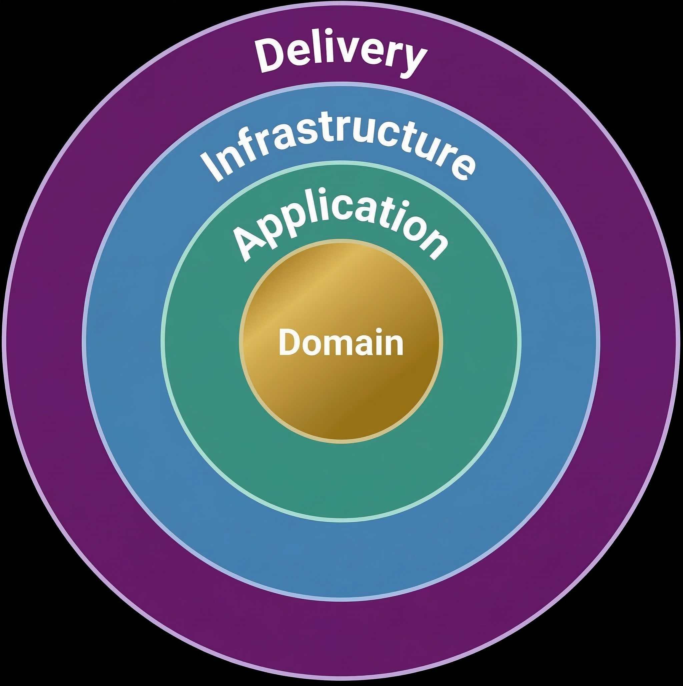
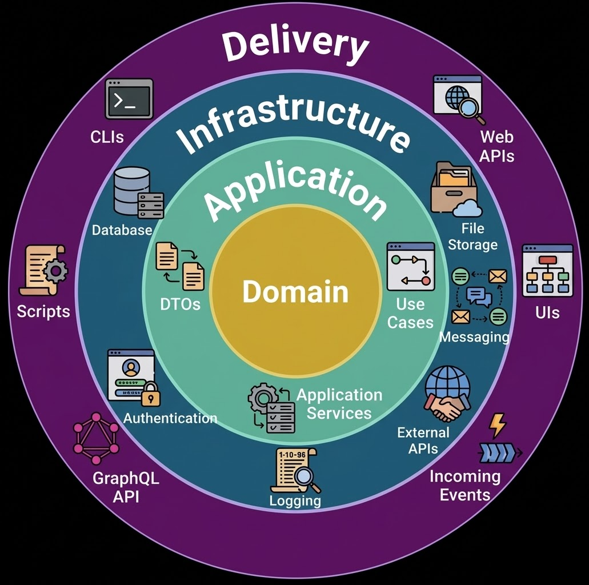
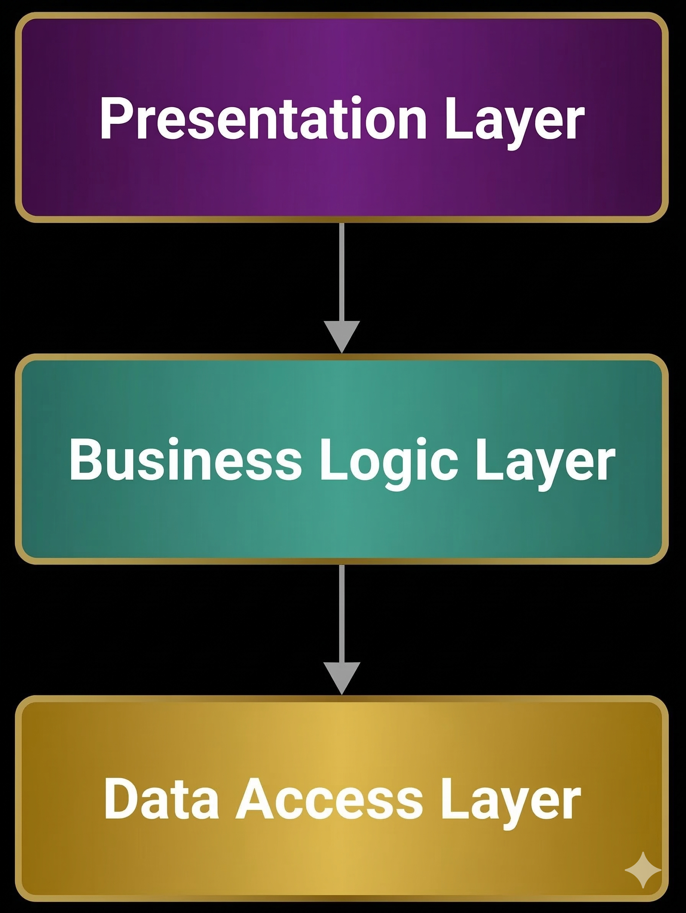
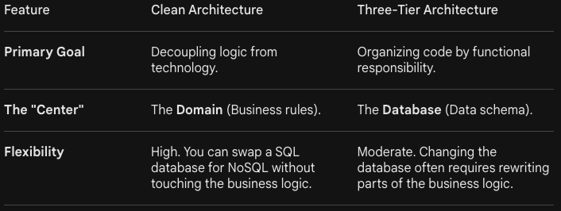
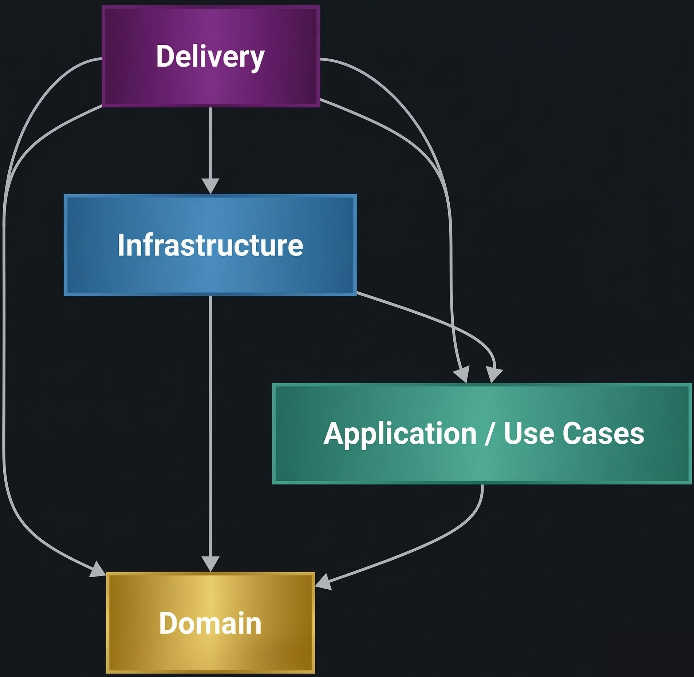

## What this is about {.center .middle}

- Keep the most important logic **separate**
- Avoid mixing it with:
  - UI code
  - database code
  - api / cli / framework details
- Treat tools and frameworks as **replaceable**

---

## The problem {.center .middle}

- When everything is tightly connected:
  - changes get harder
  - bugs spread farther
  - testing becomes painful
  - new features become riskier
  - mental models become more complex
- Business rules end up locked to specific tools

---

## The simple solution {.center .middle}

- Put core business rules in the **center**
- Put changing technology on the **outside**
- Keep the center stable even if the outside changes
- Do not couple parts together unnecessarily

## Clean Architecture {.center .middle}

{width=75%}

## Clean Architecture examples {.center .middle}

{width=75%}

## Three Tiered Architecture {.center .middle}

{width=75%}

## Three Tiered vs Clean {.center .middle}

{width=75%}

## Clean Architecture examples {.center .middle}

{width=75%}

## Clean Architecture Dependencies {.center .middle}

{width=75%}

---

## The layers (simple view) {.center .middle}

- **Delivery**
- **Infrastructure**
- **Application**
- **Domain**

---

## Domain {.center .middle}

- The entities and invariants of the problem space
- Should change the least often
- Should not know about:
  - web frameworks
  - databases
  - screens and views
  - external services

---

## Application {.center .middle}

- Orchestrates the domain logic to solve specific use-cases
- Accepts and returns data in standard formats (e.g. DTOs)
  - inputs → rules → outputs
- Changes when the app’s behavior changes
- See this as the API to your domain

---

## Data Transfer Objects (DTOs) {.center .middle}

- Transfers data between inside and outside parts
- Enforces standard formats and types
- Keeps the core logic decoupled from external representations
- Can be simple classes or dictionaries
- Should not contain business logic

---

## Infrastructure {.center .middle}

- Database
- File Storage
- External APIs
- Third-party services
- Authentication
- Logging

> Useful, but not the “heart” of the system.

---

## The main rule {.center .middle}

- Inner parts should **not depend** on outer parts
- The core should not “know about” the infrastructure or delivery details
- Dependencies should point **inward**

---

## Why this helps {.center .middle}

- Easier to test the core logic
- Easier to change tools later
- Easier to understand the system
- Less risk when making updates

---

## Key takeaway {.center .middle}

- Protect business logic from changing technology
- Keep the important rules at the center
- Build so the core stays clean and stable
